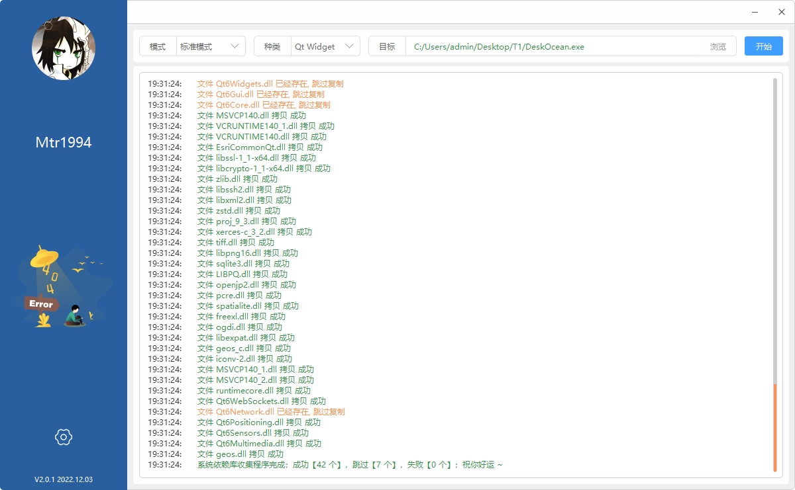

# `Auxilium`


#### 一、简介

`Auxilium` 程序用于打包 `QWidget` 程序 和 `Quick` 程序。

* 标准模式：收集 `*.exe` 可执行程序的依赖库，并寻找这些依赖库的后续一层依赖。
* 贪婪模式：收集 `*.exe` 可执行程序的依赖和每一个 `*.dll` 或 `*.so` 的后续依赖。

系统能正常工作于 `Windows` 系统和 `Linux` 系统。

> 注意，在通过 Qt 编译的方式运行该程序的时候，要保证选用的构建套件版本跟目标可执行文件的构建套件一致。

#### 二、开发日志

##### 2024 年05月08日

- [x] 添加对 `Qt 6.x.x` 的支持

##### 2023 年05月11日

- [x] 修正空格路径无法使用 `dumpbin` 和 `ldd` 打开的问题

##### 2023 年04月24日

- [x] 修改动态库检索逻辑

##### 2023 年02月06日

- [x] 加入依赖库拷贝过程文件

##### 2023 年01月20日

- [x] 加入标准模式，略微增加了包的大小，提升了成功运行的概率。

##### 2022 年12月05日

- [x] 配置窗口等待完成
- [x] 改名为 `Auxilium`，中文含义是 “辅助装置、打辅助的人”
- [x] 新增依赖库检索路径管理功能
- [x] 新增 `QML` 类型程序打包功能
- [x] 新增 `Linux` 系统下的打包逻辑（Linux 系统下，手动配置的检索路径无效）

#### 三、安装包制作注意事项

* 使用 `Inno Setup` 制作安装包的注意事项

  ```
  1、选择程序文件的时候，直接添加程序主目录并自动获取子目录就好，不用手动添加程序目录下的文件
  
  2、默认的安装包安装在 `C 盘`后只能使用管理员权限运行，需要加入以下命令
  
  	[Dirs]
  	Name: {app}; Permissions: users-full
  	
  	可以放到 [Run] 字段上面
  	
  3、在配置 Compiler Setting 的时候请注意
  
  	* Custom compiler output folder  	表示的是编译后的安装文件的输出路径
  	* Compiler output base file name       表示的是编译后的安装文件的名称
  	* Coutom SetUp icon file 		    表示的是编译后的安装文件的图标 （.ico 格式）
  	* Setup password 			      表示的是编译后的安装文件的安装密码
  	
  ```
  

#### 四、功能展示

​	
